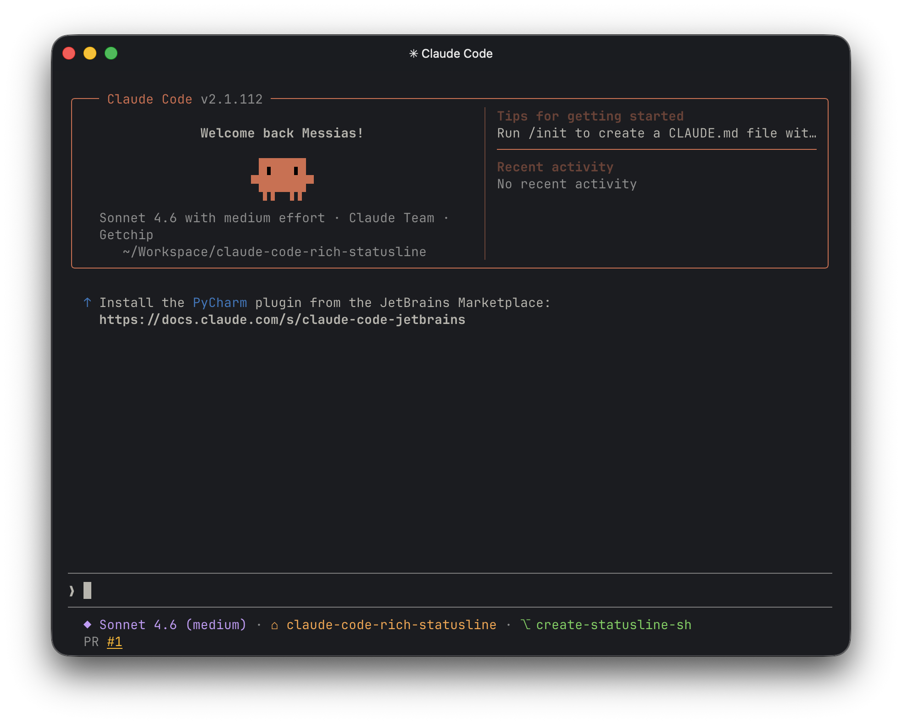

# claude-code-rich-statusline



A custom status line script for Claude Code that displays rich session information in your terminal — context window usage, model name, current project, and git branch.

> **Note:** Only tested on macOS.

## Preview

```
◈ 42% · ◆ Claude Sonnet 4.6 (high) · ⌂ my-project · ⎇ main
```

## Requirements

- [Claude Code](https://claude.ai/code) CLI installed
- [`jq`](https://stedolan.github.io/jq/) — for JSON parsing
- A terminal with ANSI color support

Install `jq` if you don't have it:

```bash
# macOS
brew install jq

# Debian/Ubuntu
sudo apt install jq
```

## Setup

### 1. Download the script

Clone this repo or copy `statusline.sh` to a location of your choice:

```bash
git clone https://github.com/messias/claude-code-rich-statusline.git
# or just copy statusline.sh somewhere, e.g. ~/.claude/statusline.sh
```

### 2. Make it executable

```bash
chmod +x /path/to/statusline.sh
```

### 3. Configure Claude Code to use it

Claude Code supports a custom status line via the `statusCommand` setting. Add it to your settings file:

**User-level** (`~/.claude/settings.json`):

```json
{
  "statusLine": {
    "type": "command",
    "command": "~/.claude/statusline.sh"
  }
}
```

### 4. (Optional) Set effort level

The status line can display your current effort level if set in `~/.claude/settings.json` or `~/.claude/settings.local.json`:

```json
{
  "effortLevel": "high"
}
```

## What it displays

| Symbol | Field                     | Source                                |
| ------ | ------------------------- | ------------------------------------- |
| `◈`    | Context window usage (%)  | Claude Code session data              |
| `◆`    | Model name + effort level | Claude Code session data + settings   |
| `⌂`    | Project folder name       | Current working directory             |
| `⎇`    | Git branch                | Session data or `git branch` fallback |

## How it works

Claude Code pipes a JSON payload to the configured `statusCommand` via stdin. The script reads that JSON using `jq`, extracts the relevant fields, and prints a formatted, color-coded status line back to the terminal.
