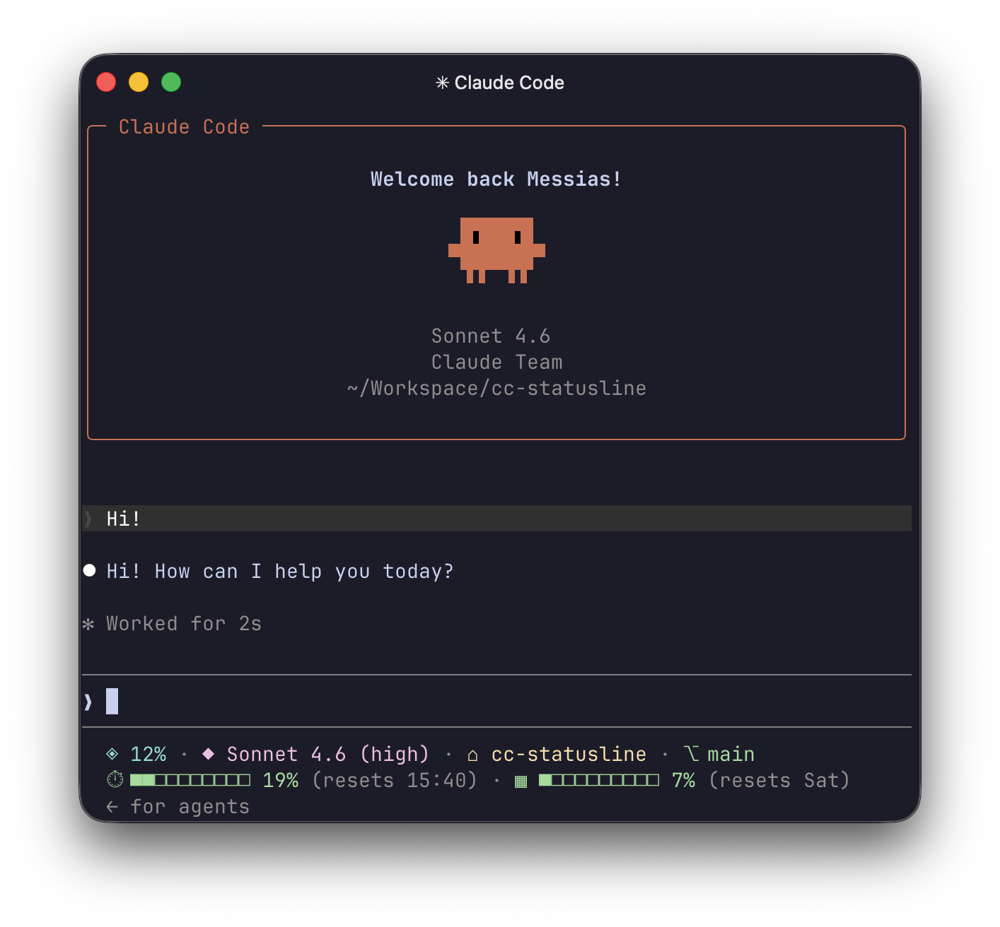

# cc-statusline



A rich, multi-line status line for [Claude Code](https://claude.ai/code) — context window usage,
model name + reasoning effort, current project, git branch, and your Claude plan rate-limit usage
as progress bars. Written in TypeScript, shipped as a single dependency-free Node binary.

> **Note:** Only tested on macOS.

## Preview

```
◈ 42% · ◆ Opus (high) · ⌂ my-project · ⎇ main
⏱ ██░░░░░░░░ 23% (resets 14:30) · ▦ ████░░░░░░ 41% (resets Fri)
```

> Line 2 (rate-limit bars) only appears for Claude.ai Pro/Max subscribers, after the first API
> response in a session.

## Requirements

- [Claude Code](https://claude.ai/code) CLI
- [Node.js](https://nodejs.org) ≥ 18 (only `git` is used at runtime; no other external tools)
- A terminal with ANSI color support

## Setup

### Recommended: global install (auto-configures)

```bash
npm install -g @appoutlet/cc-statusline
```

The install automatically writes the status line into `~/.claude/settings.json` (creating the file
if needed, and never overwriting an existing `statusLine`). The resulting config is:

```json
{
  "statusLine": {
    "type": "command",
    "command": "cc-statusline"
  }
}
```

If you ran with `--ignore-scripts`, set `CC_STATUSLINE_NO_SETUP=1`, or already had a different
`statusLine`, just add the snippet above manually.

A global install is recommended because the status line runs on **every render** — the binary is
invoked directly with no per-render resolution overhead.

### Alternative: no install (npx)

```json
{
  "statusLine": {
    "type": "command",
    "command": "npx -y @appoutlet/cc-statusline"
  }
}
```

`npx` re-resolves the package on every render, so it is noticeably slower for a status line, and it
does not run the auto-setup or auto-update. Use `-y` because stdin carries the JSON payload and
cannot answer npx's first-run install prompt.

## Auto-update

When installed globally, `cc-statusline` keeps itself current with npm. At most once every 24 hours
it checks the registry in a **detached background process** — it never delays a render — and, when a
newer version is published, updates the global install in place. A dim `⬆ vX.Y.Z` indicator appears
on line 1 while an update is pending or if it could not be applied.

If the npm global prefix isn't writable by your user, the auto-update can't run; the `⬆` indicator
then reminds you to update manually:

```bash
npm i -g @appoutlet/cc-statusline@latest
```

Environment variables:

| Variable                        | Effect                                           |
| ------------------------------- | ------------------------------------------------ |
| `CC_STATUSLINE_NO_UPDATE`       | Disable update checks entirely                   |
| `CC_STATUSLINE_UPDATE_DRY_RUN`  | Check and notify (`⬆`) but never install         |
| `CC_STATUSLINE_UPDATE_INTERVAL` | Hours between checks (default `24`)              |
| `CC_STATUSLINE_NO_SETUP`        | Skip the postinstall settings.json configuration |

## What it displays

| Symbol | Field                     | Source                                 |
| ------ | ------------------------- | -------------------------------------- |
| `◈`    | Context window usage (%)  | `context_window.used_percentage`       |
| `◆`    | Model name + effort level | `model.display_name` + `effort.level`  |
| `⌂`    | Project folder name       | `workspace.current_dir`                |
| `⎇`    | Git branch                | `git branch --show-current`            |
| `⏱`    | 5-hour rate-limit bar     | `rate_limits.five_hour` (Pro/Max only) |
| `▦`    | 7-day rate-limit bar      | `rate_limits.seven_day` (Pro/Max only) |
| `⬆`    | Update available          | background update check                |

### Progress bar colors

The icon, bar, and percentage are all colored by usage level:

| Range  | Color  |
| ------ | ------ |
| 0–60%  | Green  |
| 61–80% | Yellow |
| 81–95% | Orange |
| > 95%  | Red    |

## How it works

Claude Code pipes a JSON payload to the configured command on stdin. `cc-statusline` parses it with
native `JSON.parse` (no `jq` needed), composes the two lines, and prints them — then, only when due,
fires a throttled background update check that exits without blocking output.

## Development

```bash
npm install        # installs deps and wires the Husky pre-push hook
npm run typecheck  # tsc --noEmit
npm run lint       # eslint
npm run format     # prettier --write
npm run build      # esbuild → dist/{cli,install,update}.js
```

Code is organized one feature per file under `src/` (`segments/usage.ts`, `update/*`, etc.). A Husky
**pre-push** hook runs typecheck + lint + format check, so every push is clean.

## Legacy (bash)

The original dependency on [`jq`](https://stedolan.github.io/jq/) lives on in
[`statusline.sh`](./statusline.sh) for users who prefer a pure shell script. Install `jq`
(`brew install jq` / `apt install jq`), make it executable, and point your `statusLine.command` at
the script path.

## License

[Apache 2.0](./LICENSE)
